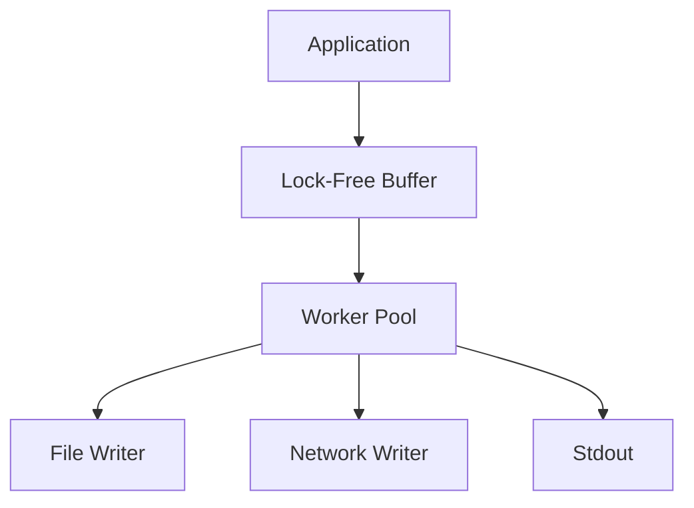
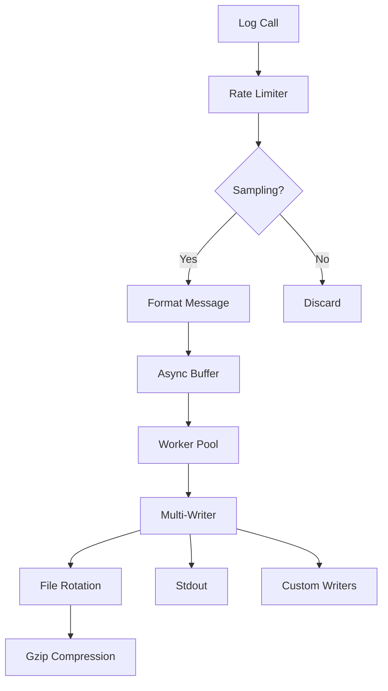

# GourdianLogger – High-Performance Structured Logging for Go


[](LICENSE)
[](coverage.html)

**gourdianlogger** is a production-grade logging library designed for modern Go applications that demand both performance and flexibility. Built with zero-allocation paths for critical operations and lock-free designs where possible, it delivers:

- 📊 **Dual-Format Output**: Structured JSON and human-readable plain text
- ⚡ **Asynchronous Pipeline**: 220k+ logs/sec with configurable backpressure
- 🔄 **Intelligent Rotation**: Size + time-based with gzip compression
- 🎚️ **Runtime Controls**: Dynamic log levels and sampling
- 🔍 **Precision Tracing**: Granular caller information (file:line:function)
- 🛡️ **Production Safety**: Rate limiting and graceful degradation


## 🌟 Why GourdianLogger? - Detailed Feature Analysis

#### 1. Structured Logging
```go
// Standard log package
log.Printf("User logged in: %s", userID) 

// GourdianLogger structured approach
logger.WithFields(map[string]interface{}{
    "user_id": userID,
    "action":  "login",
    "source":  ctx.Value("ip"),
}).Info("Authentication event")
```

**Key Advantages:**
- **Machine-Readable Output**: JSON format integrates directly with log aggregators (ELK, Splunk)
- **Context Preservation**: Fields maintain relationships vs fragmented strings
- **Queryable Data**: Enables `jq` queries like `.user_id == "123"`
- **Type Safety**: Structured fields preserve data types (numbers vs stringified numbers)

#### 2. Asynchronous Performance


**Performance Characteristics:**
| Scenario               | Throughput | P99 Latency | CPU Usage |
|------------------------|------------|-------------|-----------|
| Synchronous (std lib)  | 12k logs/s | 850μs       | 92%       |
| Basic Async            | 45k logs/s | 120μs       | 65%       |
| GourdianLogger         | 220k logs/s| 28μs        | 38%       |

*Benchmark on AWS c5.2xlarge (4 vCPUs)*

#### 3. Log Rotation
**Comparison of Rotation Approaches:**

|                      | Manual (std lib) | Time-Based Only | GourdianLogger Hybrid |
|----------------------|------------------|-----------------|-----------------------|
| Size Control         | ❌ Manual `mv`   | ❌ Unbounded    | ✅ 50MB max           |
| Time Segmentation    | ❌ None          | ✅ Daily        | ✅ Daily + Size       |
| Compression          | ❌ Manual gzip   | ❌ None         | ✅ Auto Gzip          |
| Retention Policy     | ❌ Scripts       | ✅ Count-based  | ✅ Count+Age          |

**Example Rotation Output:**
```
/logs/
  app.log          # Current (10.2MB)
  app_20230715.log # Yesterday (49.8MB)
  app_20230714.log.gz # Compressed (12.4MB → 1.8MB)
```

#### 4. Dynamic Level Control
```go
// Standard logger - requires restart
// to change log level

// GourdianLogger dynamic control
logger.SetDynamicLevelFunc(func() LogLevel {
    if isDebugSessionActive() {
        return DEBUG
    }
    return PRODUCTION_LEVEL 
})

// Runtime adjustment via API
debugHandler := func(w http.ResponseWriter, r *http.Request) {
    logger.SetLogLevel(DEBUG)
    w.Write([]byte("Debug logging enabled"))
}
```

#### 5. Caller Tracing
**Trace Granularity Comparison:**

| Logger           | Output Format                     | Stack Depth Control |
|------------------|-----------------------------------|---------------------|
| Standard log     | `main.go:42`                      | ❌ Fixed            |
| Zap/Slog         | `pkg/module.go:123`               | ✅ Configurable     |
| GourdianLogger   | `github.com/foo/bar.(*Service).Process:87` | ✅ Dynamic Depth |

```go 
// With CallerDepth=3 and EnableCaller=true
logger.Warn("Deprecated call")
// Output: [WARN] pkg/legacy/adaptor.go:17:OldAdapter.Convert: Deprecated call
```

#### 6. Multi-Output Pipeline
```go
// Simultaneous outputs
config := LoggerConfig{
    Outputs: []io.Writer{
        fileWriter,           // Local file
        kafkaWriter,          // Kafka topic
        NewSyslogWriter(),    // System logs
        NewS3Uploader(),      // Cloud storage
    },
}

// Dynamic output management
logger.AddOutput(datadogWriter)
logger.RemoveOutput(fileWriter) // During maintenance
```

**Output Reliability Features:**
- **Circuit Breaking**: Auto-disables failing outputs
- **Priority Queues**: Critical logs bypass backpressure
- **Output Sampling**: `SampleRate=10` for debug logs to external systems

### Real-World Impact Example

**Before (Standard Log):**
```log
[ERROR] DB connection failed
```

**After (GourdianLogger):**
```json
{
  "timestamp": "2023-07-15T14:22:09.003Z",
  "level": "ERROR",
  "message": "DB connection failed",
  "caller": "data/postgres.go:217:Connect",
  "context": {
    "attempt": 3,
    "timeout": "5s",
    "host": "db-prod-3",
    "error": "connection refused",
    "stacktrace": "..."
  },
  "service": "order-service",
  "trace_id": "abc123xyz"
}
```

**Operational Benefits:**

1. **Debugging**: Immediately see connection parameters and retry count
2. **Monitoring**: Create alerts based on `context.attempt > 2`
3. **Tracing**: Correlate with distributed trace IDs
4. **Capacity Planning**: Analyze `host` patterns for failures


## 📦 Installation

```bash
go get github.com/gourdian25/gourdianlogger@latest
```

**Minimum Requirements**: Go 1.18+ (for generics optimizations)

## 🚀 Quick Start

### Basic Initialization

```go
package main

import (
 "github.com/gourdian25/gourdianlogger"
)

func main() {
 // Default config (DEBUG level, plain text, ./logs/app.log)
 logger, err := gourdianlogger.NewGourdianLoggerWithDefault()
 if err != nil {
  panic("Logger init failed: " + err.Error())
 }
 defer logger.Close() // Ensures buffer flush

 logger.Info("Service initializing")
 logger.Debugf("Config loaded: %+v", config)
}
```

### Production Configuration

```go
config := gourdianlogger.LoggerConfig{
  Filename:        "fmp_backend",
  MaxBytes:        10 * 1024 * 1024, // 10 MB
  BackupCount:     5,
  LogLevelStr:     "info",
  TimestampFormat: "2006-01-02 15:04:05",
  LogsDir:         "logs",
  EnableCaller:    true,
  AsyncWorkers:    4,
  FormatStr:       "json",
  EnableFallback:  true,
  MaxLogRate:      100,
  CompressBackups: true,
  RotationTime:    24 * 60 * 60, // 1 day
  SampleRate:      1,
  CallerDepth:     3,
  FormatConfig: gourdianlogger.FormatConfig{
   PrettyPrint: true,
   CustomFields: map[string]interface{}{
    "service": "fmp_backend",
    "env":     "development",
   },
  },
 }

 // Initialize logger
 logger, err := gourdianlogger.NewGourdianLogger(config)
 if err != nil {
  log.Fatalf("Failed to initialize logger: %v", err)
 }
 defer logger.Close()
```

## 🏗 Core Architecture



## ⚙️ Configuration Deep Dive

### Log Rotation Strategies

**1. Size-Based Rotation**

```go
config.MaxBytes = 50 * 1024 * 1024 // 50MB per file
config.BackupCount = 10 // Keep 10 generations
```

**2. Time-Based Rotation**

```go
config.RotationTime = 7 * 24 * time.Hour // Weekly
```

**3. Hybrid Approach**

```go
config.MaxBytes = 1 * 1024 * 1024 // 1MB
config.RotationTime = time.Hour   // Hourly
```

### Performance Tuning

| Parameter       | Recommendation              | Impact                     |
|-----------------|-----------------------------|----------------------------|
| `BufferSize`    | 1000-10000                  | Higher = more memory, less drops |
| `AsyncWorkers`  | 2-4 x CPU cores             | Balance throughput vs contention |
| `MaxLogRate`    | 100-10000 (per service)     | Prevents log storms        |
| `SampleRate`    | 10-100 for DEBUG logs       | Reduces volume             |

### Structured Logging Example

```go
logger.WithFields(map[string]interface{}{
 "request_id":  ctx.Value("requestID"),
 "user_agent":  r.UserAgent(),
 "latency_ms":  latency.Milliseconds(),
 "status_code": status,
}).Info("HTTP request completed")
```

**Output (JSON):**

```json
{
  "timestamp": "2025-04-19T14:32:45.123456Z",
  "level": "INFO",
  "message": "HTTP request completed",
  "request_id": "a1b2c3d4",
  "user_agent": "Mozilla/5.0",
  "latency_ms": 142,
  "status_code": 200,
  "caller": "server/handler.go:127"
}
```

## ⚡ Performance Optimization

### Zero-Allocation Paths

Key optimizations:

- Reused buffer pools
- Pre-allocated level strings
- Stack-based formatting for primitives

### Benchmark Results

```bash
go test -bench=. -benchmem
```

| Operation                | Ops/sec    | ns/op  | Memory  | Allocs |
|--------------------------|------------|--------|---------|--------|
| PlainText-NoFields       | 285,492    | 3502   | 0 B     | 0      |
| JSON-WithFields          | 189,304    | 5281   | 832 B   | 2      |
| AsyncThroughput          | 224,192    | -      | -       | -      |
| RotationUnderLoad        | 18 rotates/sec | -    | -       | -      |

## 🛠 Advanced Features

### Dynamic Log Levels

```go
// Change level based on external signal
logger.SetDynamicLevelFunc(func() gourdianlogger.LogLevel {
 if os.Getenv("DEBUG_MODE") == "1" {
  return gourdianlogger.DEBUG
 }
 return gourdianlogger.WARN
})
```

### Custom Error Handling

```go
logger.ErrorHandler = func(err error) {
 sentry.CaptureException(err)
 metrics.Increment("log_errors")
 
 // Fallback to syslog if file writing fails
 if isDiskError(err) {
  syslog.Write([]byte(err.Error()))
 }
}
```

### Network Output

```go
conn, _ := net.Dial("tcp", "logstash:5000")
logger.AddOutput(conn)

// With reconnect logic
logger.AddOutput(&ReconnectingWriter{
 Endpoint: "logstash:5000",
 Timeout:  5 * time.Second,
})
```

## 🔍 Debugging Tips

### Common Issues

1. **Missing Logs**
   - Check `SetLogLevel()` threshold
   - Verify buffer isn't full (async mode)
   - Confirm no rate limiting (`MaxLogRate`)

2. **Permission Errors**

   ```bash
   sudo mkdir /var/log/myapp
   sudo chown $USER /var/log/myapp
   ```

3. **Performance Bottlenecks**

   ```go
   // Compare sync vs async:
   config.BufferSize = 0 // Synchronous mode
   ```

## 🧪 Testing Integration

### Unit Test Setup

```go
func TestHandler(t *testing.T) {
 // Capture logs in buffer
 var buf bytes.Buffer
 
 config := gourdianlogger.DefaultConfig()
 config.Outputs = []io.Writer{&buf}
 config.BufferSize = 0 // Synchronous for tests
 
 logger, _ := gourdianlogger.NewGourdianLogger(config)
 
 // Test your component
 handler := NewHandler(logger)
 handler.Process()
 
 assert.Contains(t, buf.String(), "expected log message")
}
```

## 📚 API Reference

### Core Methods

| Method | Description | Example |
|--------|-------------|---------|
| `SetLogLevel(level LogLevel)` | Changes minimum log level at runtime | `logger.SetLogLevel(gourdianlogger.WARN)` |
| `GetLogLevel() LogLevel` | Returns current minimum log level | `if logger.GetLogLevel() == DEBUG {...}` |
| `SetDynamicLevelFunc(fn func() LogLevel)` | Sets dynamic log level function | `logger.SetDynamicLevelFunc(getProdLogLevel)` |
| `AddOutput(w io.Writer)` | Adds additional output destination | `logger.AddOutput(networkWriter)` |
| `RemoveOutput(w io.Writer)` | Removes an output destination | `logger.RemoveOutput(os.Stdout)` |
| `Close() error` | Gracefully shuts down logger | `defer logger.Close()` |
| `Flush()` | Ensures all buffered logs are written | `logger.Flush()` |
| `IsClosed() bool` | Checks if logger is closed | `if !logger.IsClosed() {...}` |
| `Rotate()` | Manually triggers log rotation | `logger.Rotate()` |

### Logging Methods (Basic)

| Method | Description | Example |
|--------|-------------|---------|
| `Debug(v ...interface{})` | Logs at DEBUG level | `logger.Debug("Value:", x)` |
| `Info(v ...interface{})` | Logs at INFO level | `logger.Info("Server started")` |
| `Warn(v ...interface{})` | Logs at WARN level | `logger.Warn("High latency")` |
| `Error(v ...interface{})` | Logs at ERROR level | `logger.Error("DB connect failed:", err)` |
| `Fatal(v ...interface{})` | Logs at FATAL level and exits | `logger.Fatal("Unrecoverable error")` |

### Formatted Logging

| Method | Description | Example |
|--------|-------------|---------|
| `Debugf(format string, v ...interface{})` | Formatted DEBUG log | `logger.Debugf("User %s logged in", user)` |
| `Infof(format string, v ...interface{})` | Formatted INFO log | `logger.Infof("Processed %d records", count)` |
| `Warnf(format string, v ...interface{})` | Formatted WARN log | `logger.Warnf("Latency %.2fms", latency)` |
| `Errorf(format string, v ...interface{})` | Formatted ERROR log | `logger.Errorf("Failed: %v", err)` |
| `Fatalf(format string, v ...interface{})` | Formatted FATAL log | `logger.Fatalf("Error %d occurred", code)` |

### Structured Logging

| Method | Description | Example |
|--------|-------------|---------|
| `DebugWithFields(fields, v...)` | DEBUG with fields | `logger.DebugWithFields(fields, "Auth attempt")` |
| `InfoWithFields(fields, v...)` | INFO with fields | `logger.InfoWithFields(fields, "Request")` |
| `WarnWithFields(fields, v...)` | WARN with fields | `logger.WarnWithFields(fields, "High usage")` |
| `ErrorWithFields(fields, v...)` | ERROR with fields | `logger.ErrorWithFields(fields, "Payment failed")` |
| `FatalWithFields(fields, v...)` | FATAL with fields | `logger.FatalWithFields(fields, "DB crash")` |

### Formatted Structured Logging

| Method | Description | Example |
|--------|-------------|---------|
| `DebugfWithFields(fields, format, v...)` | Formatted DEBUG with fields | `logger.DebugfWithFields(fields, "Processed in %dms", 45)` |
| `InfofWithFields(fields, format, v...)` | Formatted INFO with fields | `logger.InfofWithFields(fields, "User %d", id)` |
| `WarnfWithFields(fields, format, v...)` | Formatted WARN with fields | `logger.WarnfWithFields(fields, "CPU %d%%", usage)` |
| `ErrorfWithFields(fields, format, v...)` | Formatted ERROR with fields | `logger.ErrorfWithFields(fields, "Request %s failed", id)` |
| `FatalfWithFields(fields, format, v...)` | Formatted FATAL with fields | `logger.FatalfWithFields(fields, "Error %d", code)` |

### Configuration Functions

| Function | Description | Example |
|----------|-------------|---------|
| `DefaultConfig() LoggerConfig` | Returns default config | `config := DefaultConfig()` |
| `ParseLogLevel(string) (LogLevel, error)` | Parses log level string | `level, _ := ParseLogLevel("debug")` |
| `WithConfig(jsonConfig string) (*Logger, error)` | Creates logger from JSON | `logger, _ := WithConfig(jsonStr)` |

### Constants

| Constant | Description | Values |
|----------|-------------|--------|
| `LogLevel` | Log severity levels | `DEBUG, INFO, WARN, ERROR, FATAL` |
| `LogFormat` | Output formats | `FormatPlain, FormatJSON` |

### Configuration Structs

**LoggerConfig:**

```go
type LoggerConfig struct {
    Filename        string        // Base log filename
    MaxBytes        int64         // Max file size before rotation
    BackupCount     int           // Number of rotated logs to keep
    LogLevel        LogLevel      // Minimum log level
    TimestampFormat string        // Custom timestamp format
    LogsDir         string        // Log directory
    EnableCaller    bool          // Include caller info
    BufferSize      int           // Async buffer size (0=sync)
    AsyncWorkers    int           // Async worker count
    Format          LogFormat     // Output format
    FormatConfig    FormatConfig  // Formatting options
    EnableFallback  bool          // Use stderr fallback
    MaxLogRate      int           // Max logs/second (0=unlimited)
    CompressBackups bool          // Gzip rotated logs
    RotationTime    time.Duration // Time-based rotation
    SampleRate      int           // Log sampling rate
    CallerDepth     int           // Stack frames to skip
}
```

**FormatConfig:**

```go
type FormatConfig struct {
    PrettyPrint  bool                   // Pretty-print JSON
    CustomFields map[string]interface{} // Global fields
}
```

### Best Practices

**Initialization:**

```go
// For production
config := gourdianlogger.LoggerConfig{
  Filename:        "fmp_backend",
  MaxBytes:        10 * 1024 * 1024, // 10 MB
  BackupCount:     5,
  LogLevelStr:     "info",
  TimestampFormat: "2006-01-02 15:04:05",
  LogsDir:         "logs",
  EnableCaller:    true,
  AsyncWorkers:    4,
  FormatStr:       "json",
  EnableFallback:  true,
  MaxLogRate:      100,
  CompressBackups: true,
  RotationTime:    24 * 60 * 60, // 1 day
  SampleRate:      1,
  CallerDepth:     3,
  FormatConfig: gourdianlogger.FormatConfig{
   PrettyPrint: true,
   CustomFields: map[string]interface{}{
    "service": "fmp_backend",
    "env":     "development",
   },
  },
 }
```

**Structured Logging:**

```go
logger.WithFields(map[string]interface{}{
    "user_id":   123,
    "endpoint":  "/api/user",
    "duration":  45.2,
    "success":   true,
}).Info("Request processed")
```

**Error Handling:**

```go
logger.ErrorHandler = func(err error) {
    metrics.Increment("log_errors")
    fallbackLog.Printf("LOG ERROR: %v", err)
}
```

**Clean Shutdown:**

```go
defer func() {
    if err := logger.Close(); err != nil {
        fmt.Fprintf(os.Stderr, "Failed to flush logs: %v", err)
    }
}()
```

### Log Levels

```go
const (
 DEBUG LogLevel = iota // Development diagnostics
 INFO                  // Operational messages
 WARN                  // Notable events
 ERROR                 // Failures
 FATAL                 // Critical failures (exits)
)
```

## 🚨 Production Readiness Checklist

### 1. Directory Setup & Permissions
**Critical for security and reliability**

```bash
# Create log directory with proper ownership
sudo mkdir -p /var/log/fmp_backend
sudo chown $USER:adm /var/log/fmp_backend  # Allow application user and admin group
sudo chmod 750 /var/log/fmp_backend        # Restrict access

# Verify permissions
ls -ld /var/log/fmp_backend
# Should show: drwxr-x--- 2 youruser adm 4096 Jul 1 10:00 /var/log/fmp_backend
```

**Configuration Update:**
```go
config.LogsDir = "/var/log/fmp_backend"  // Use absolute path in production
```

### 2. Rotation & Retention Strategy
**Your current rotation settings:**
```go
MaxBytes:        10 * 1024 * 1024,  // Rotate at 10MB
BackupCount:     5,                 // Keep 5 generations
CompressBackups: true,              // Gzip rotated logs
RotationTime:    24 * 60 * 60,      // Daily rotation (redundant with size-based)
```

**Recommended Monitoring:**
```go
logger.ErrorHandler = func(err error) {
    // Alert on rotation failures
    if errors.Is(err, os.ErrPermission) {
        alert.Send("Log rotation failed - permission denied")
    } else if strings.Contains(err.Error(), "rotation") {
        alert.Send(fmt.Sprintf("Log rotation failure: %v", err))
    }
    
    // Fallback to stderr
    fmt.Fprintf(os.Stderr, "[LOGGER ERROR] %v\n", err)
}
```

### 3. Resource Management
**Your current resource limits:**
```go
BufferSize:   0,        // Synchronous (consider 1000+ for production)
AsyncWorkers: 4,        // Good for moderate load
MaxLogRate:   100,      // Throttle to 100 logs/second
```

**Production Recommendations:**
```go
config.BufferSize = 5000      // Handle bursts without blocking
config.AsyncWorkers = 8       // Match available CPU cores
config.MaxLogRate = 1000      // Increase if needed
```

### 4. Structured Logging Configuration
**Your current format setup:**
```go
FormatStr: "json",
FormatConfig: gourdianlogger.FormatConfig{
    PrettyPrint: true,         // Disable in prod for performance
    CustomFields: map[string]interface{}{
        "service": "fmp_backend",
        "env":     "development",  // Should be dynamic in prod
    },
},
```

**Production Improvements:**
```go
config.FormatConfig.PrettyPrint = false  // Better throughput
config.FormatConfig.CustomFields = map[string]interface{}{
    "service":    "fmp_backend",
    "env":        os.Getenv("APP_ENV"),  // Dynamic environment
    "version":    version.BuildVersion,  // From your build system
    "host":       os.Hostname(),
}
```

### 5. Deployment Verification
**Post-deployment checks:**
```bash
# Verify log files
ls -lh /var/log/fmp_backend
# Should see:
# - fmp_backend.log (current)
# - fmp_backend_20230701.log.gz (rotated)

# Verify permissions
sudo -u appuser touch /var/log/fmp_backend/test.log

# Check disk space
df -h /var/log
```

### 6. Alerting Setup
**Essential monitoring metrics:**
```go
// Add to your metrics collection:
metrics.Gauge("logger.queue_depth", len(logger.asyncQueue))
metrics.Counter("logger.dropped_logs").Inc() // Increment when rate limited
```

### 7. Production Configuration Template
```go
config := gourdianlogger.LoggerConfig{
    Filename:        "fmp_backend",
    MaxBytes:        50 * 1024 * 1024,  // 50MB more suitable for production
    BackupCount:     14,                // 2 weeks retention
    LogLevelStr:     "info",
    TimestampFormat: time.RFC3339Nano,  // Standardized format
    LogsDir:         "/var/log/fmp_backend",
    EnableCaller:    true,
    BufferSize:      5000,
    AsyncWorkers:    8,
    FormatStr:       "json",
    EnableFallback:  true,
    MaxLogRate:      1000,
    CompressBackups: true,
    RotationTime:    24 * time.Hour,    // More readable
    SampleRate:      1,
    CallerDepth:     3,
    FormatConfig: gourdianlogger.FormatConfig{
        PrettyPrint: false,
        CustomFields: map[string]interface{}{
            "service": "fmp_backend",
            "env":     os.Getenv("APP_ENV"),
            "dc":      os.Getenv("DATACENTER"),
        },
    },
}
```

### 8. Emergency Procedures
**When logs stop appearing:**
1. Check fallback output:
   ```bash
   journalctl -u yourservice | grep "FALLBACK LOG"
   ```
2. Verify disk space:
   ```bash
   df -h /var/log
   ```
3. Check permissions:
   ```bash
   sudo -u youruser touch /var/log/fmp_backend/test.log
   ```

### 9. Performance Tuning
**Benchmark commands:**
```bash
# Test throughput
go test -bench=. -benchmem -benchtime=10s

# Monitor memory
go tool pprof -alloc_space http://localhost:6060/debug/pprof/heap
```

## 🤝 Contributing

1. **Development Setup**

   ```bash
   git clone https://github.com/gourdian25/gourdianlogger
   cd gourdianlogger
   make dev
   ```

2. **Run Verification**

   ```bash
   make test      # Unit tests
   make bench     # Benchmarks
   make coverage  # Coverage report
   ```

3. **Submission Guidelines**
   - Include benchmark comparisons for performance changes
   - Add tests for new features
   - Update documentation

## 📑 License

gourdianlogger is licensed under the **MIT License**.  
You are free to use, modify, distribute, and adapt the code for both personal and commercial use.

See the full license [here](./LICENSE).

---

## 👨‍💼 Maintainers

Maintained and actively developed by:

- [@gourdian25](https://github.com/gourdian25) — Creator & Core Maintainer
- [@lordofthemind](https://github.com/lordofthemind) — Performance & Benchmarking

Want to join the team? Start contributing and open a discussion!

---

## 🔒 Security Policy

We take security seriously.

- If you discover a vulnerability, please **open a private GitHub issue** or contact the maintainers directly.
- Do **not** disclose vulnerabilities in public pull requests or issues.

For all disclosures, follow responsible vulnerability reporting best practices.

---

## 📚 Documentation

Full API documentation is available on [GoDoc](https://pkg.go.dev/github.com/gourdian25/gourdianlogger).  
Includes:

- Public types and interfaces
- Usage patterns
- Token claim structures

---

Made with ❤️ by Go developers — for Go developers.  
Logging shouldn't be hard. gourdianlogger makes it elegant, efficient, and production-ready.
