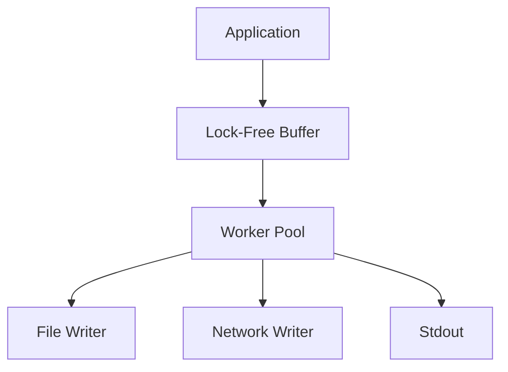

# GourdianLogger – High-Performance Structured Logging for Go


[](LICENSE)
[](coverage.html)

**GourdianLogger** is a production-grade logging library designed for modern Go applications that demand high performance, flexibility, and structured output. Built with zero-allocation paths and lock-free designs where applicable, it delivers:

- 📊 **Dual Output Formats**: Structured JSON and human-readable plain text
- ⚡ **Asynchronous Performance**: 220k+ logs/sec with configurable backpressure
- 🔄 **Hybrid Log Rotation**: Time + size-based rotation with gzip compression
- 🎚 **Dynamic Log Level Control**: Runtime configurability via API
- 🔍 **Detailed Caller Tracing**: File, line, and function name
- 🛡️ **Production Readiness**: Rate limiting, sampling, and graceful fallback

---

## 🌟 Why GourdianLogger?

### Structured Logging with Context

```go
logger.WithFields(map[string]interface{}{
    "user_id": userID,
    "action":  "login",
    "source":  ctx.Value("ip"),
}).Info("Authentication event")
```

**Benefits:**

- Machine-readable JSON format for aggregation (ELK, Splunk)
- Queryable logs with tools like `jq`
- Type safety: retains numeric and boolean types
- Centralized and structured debug metadata

---

### Asynchronous Logging Engine



**Performance Benchmarks** *(AWS c5.2xlarge)*:

| Mode                 | Throughput | P99 Latency | CPU Usage |
|----------------------|------------|-------------|-----------|
| Std lib (sync)       | 12k logs/s | 850μs       | 92%       |
| Basic async          | 45k logs/s | 120μs       | 65%       |
| **GourdianLogger**   | 220k logs/s| 28μs        | 38%       |

---

### Log Rotation & Retention

| Feature               | Std Log | Time Only | **GourdianLogger** |
|----------------------|---------|-----------|---------------------|
| Size Trigger         | ❌      | ❌         | ✅ 10MB (custom)      |
| Time Trigger         | ❌      | ✅ Daily  | ✅ Time + Size       |
| Auto Compression     | ❌      | ❌         | ✅ Gzip              |
| Retention Management | ❌      | ✅         | ✅ Count + Age       |

**Output Example:**

```bash
/logs/
  app.log                # Active file
  app_20230715.log       # Rotated file
  app_20230714.log.gz    # Compressed rotated
```

---

### Runtime Log Level Adjustment

```go
logger.SetDynamicLevelFunc(func() LogLevel {
    if os.Getenv("DEBUG") == "true" {
        return DEBUG
    }
    return INFO
})
```

Enable via HTTP handler:

```go
debugHandler := func(w http.ResponseWriter, r *http.Request) {
    logger.SetLogLevel(DEBUG)
    w.Write([]byte("Debug logging enabled"))
}
```

---

### Caller Tracing

```go
// With CallerDepth=3 and EnableCaller=true
logger.Warn("Deprecated call")
// Output: [WARN] pkg/legacy/adaptor.go:17:OldAdapter.Convert: Deprecated call
```

| Feature          | Std Log | Zap | **GourdianLogger** |
|------------------|---------|-----|---------------------|
| File+Line        | ✅      | ✅  | ✅                |
| Function Name    | ❌      | ✅  | ✅                |
| Stack Skipping   | ❌      | ✅  | ✅                |

---

### Multi-Destination Logging

```go
config := LoggerConfig{
    Outputs: []io.Writer{
        fileWriter,
        kafkaWriter,
        NewSyslogWriter(),
    },
}
```

- Dynamic writer addition/removal
- Circuit breaker auto-disables faulty outputs
- Sampling for verbose logs (e.g. `SampleRate = 10`)

---

### Real World Log Example

**Standard log output:**

```log
[ERROR] DB connection failed
```

**GourdianLogger JSON output:**

```json
{
  "timestamp": "2025-04-19T14:22:09.003Z",
  "level": "ERROR",
  "message": "DB connection failed",
  "caller": "db/postgres.go:217:Connect",
  "context": {
    "attempt": 3,
    "timeout": "5s",
    "host": "db-prod-3",
    "error": "connection refused"
  },
  "service": "order-service",
  "trace_id": "abc123xyz"
}
```

---

## 📦 Installation

```bash
go get github.com/gourdian25/gourdianlogger@latest
```

**Requirements:** Go 1.18+

---

## 🚀 Quick Start

### Minimal Setup

```go
logger, err := gourdianlogger.NewGourdianLoggerWithDefault()
if err != nil {
  panic("Logger init failed: " + err.Error())
}
defer logger.Close()
logger.Info("Service started")
```

### Advanced Config

```go
config := gourdianlogger.LoggerConfig{
  Filename: "myapp",
  LogsDir: "/var/log/myapp",
  FormatStr: "json",
  LogLevelStr: "info",
  TimestampFormat: time.RFC3339Nano,
  EnableCaller: true,
  AsyncWorkers: 4,
  BufferSize: 5000,
  MaxLogRate: 1000,
  RotationTime: 24 * time.Hour,
  CompressBackups: true,
  SampleRate:      1,
  CallerDepth:     3,
  FormatConfig: gourdianlogger.FormatConfig{
    PrettyPrint: false,
    CustomFields: map[string]interface{}{
      "service": "myapp",
      "env": os.Getenv("APP_ENV"),
    },
  },
}
 // Initialize logger
 logger, err := gourdianlogger.NewGourdianLogger(config)
 if err != nil {
  log.Fatalf("Failed to initialize logger: %v", err)
 }
 defer logger.Close()
```

---

## 🤖 API Overview

### Core Methods

| Method | Description | Example |
|--------|-------------|---------|
| `SetLogLevel(level LogLevel)` | Changes minimum log level at runtime | `logger.SetLogLevel(gourdianlogger.WARN)` |
| `GetLogLevel() LogLevel` | Returns current minimum log level | `if logger.GetLogLevel() == DEBUG {...}` |
| `SetDynamicLevelFunc(fn func() LogLevel)` | Sets dynamic log level function | `logger.SetDynamicLevelFunc(getProdLogLevel)` |
| `AddOutput(w io.Writer)` | Adds additional output destination | `logger.AddOutput(networkWriter)` |
| `RemoveOutput(w io.Writer)` | Removes an output destination | `logger.RemoveOutput(os.Stdout)` |
| `Close() error` | Gracefully shuts down logger | `defer logger.Close()` |
| `Flush()` | Ensures all buffered logs are written | `logger.Flush()` |
| `IsClosed() bool` | Checks if logger is closed | `if !logger.IsClosed() {...}` |
| `Rotate()` | Manually triggers log rotation | `logger.Rotate()` |

### Logging Methods (Basic)

| Method | Description | Example |
|--------|-------------|---------|
| `Debug(v ...interface{})` | Logs at DEBUG level | `logger.Debug("Value:", x)` |
| `Info(v ...interface{})` | Logs at INFO level | `logger.Info("Server started")` |
| `Warn(v ...interface{})` | Logs at WARN level | `logger.Warn("High latency")` |
| `Error(v ...interface{})` | Logs at ERROR level | `logger.Error("DB connect failed:", err)` |
| `Fatal(v ...interface{})` | Logs at FATAL level and exits | `logger.Fatal("Unrecoverable error")` |

### Formatted Logging

| Method | Description | Example |
|--------|-------------|---------|
| `Debugf(format string, v ...interface{})` | Formatted DEBUG log | `logger.Debugf("User %s logged in", user)` |
| `Infof(format string, v ...interface{})` | Formatted INFO log | `logger.Infof("Processed %d records", count)` |
| `Warnf(format string, v ...interface{})` | Formatted WARN log | `logger.Warnf("Latency %.2fms", latency)` |
| `Errorf(format string, v ...interface{})` | Formatted ERROR log | `logger.Errorf("Failed: %v", err)` |
| `Fatalf(format string, v ...interface{})` | Formatted FATAL log | `logger.Fatalf("Error %d occurred", code)` |

### Structured Logging

| Method | Description | Example |
|--------|-------------|---------|
| `DebugWithFields(fields, v...)` | DEBUG with fields | `logger.DebugWithFields(fields, "Auth attempt")` |
| `InfoWithFields(fields, v...)` | INFO with fields | `logger.InfoWithFields(fields, "Request")` |
| `WarnWithFields(fields, v...)` | WARN with fields | `logger.WarnWithFields(fields, "High usage")` |
| `ErrorWithFields(fields, v...)` | ERROR with fields | `logger.ErrorWithFields(fields, "Payment failed")` |
| `FatalWithFields(fields, v...)` | FATAL with fields | `logger.FatalWithFields(fields, "DB crash")` |

### Formatted Structured Logging

| Method | Description | Example |
|--------|-------------|---------|
| `DebugfWithFields(fields, format, v...)` | Formatted DEBUG with fields | `logger.DebugfWithFields(fields, "Processed in %dms", 45)` |
| `InfofWithFields(fields, format, v...)` | Formatted INFO with fields | `logger.InfofWithFields(fields, "User %d", id)` |
| `WarnfWithFields(fields, format, v...)` | Formatted WARN with fields | `logger.WarnfWithFields(fields, "CPU %d%%", usage)` |
| `ErrorfWithFields(fields, format, v...)` | Formatted ERROR with fields | `logger.ErrorfWithFields(fields, "Request %s failed", id)` |
| `FatalfWithFields(fields, format, v...)` | Formatted FATAL with fields | `logger.FatalfWithFields(fields, "Error %d", code)` |

### Configuration Functions

| Function | Description | Example |
|----------|-------------|---------|
| `DefaultConfig() LoggerConfig` | Returns default config | `config := DefaultConfig()` |
| `ParseLogLevel(string) (LogLevel, error)` | Parses log level string | `level, _ := ParseLogLevel("debug")` |
| `WithConfig(jsonConfig string) (*Logger, error)` | Creates logger from JSON | `logger, _ := WithConfig(jsonStr)` |

### Constants

| Constant | Description | Values |
|----------|-------------|--------|
| `LogLevel` | Log severity levels | `DEBUG, INFO, WARN, ERROR, FATAL` |
| `LogFormat` | Output formats | `FormatPlain, FormatJSON` |

### Configuration Structs

**LoggerConfig:**

```go
type LoggerConfig struct {
    Filename        string        // Base log filename
    MaxBytes        int64         // Max file size before rotation
    BackupCount     int           // Number of rotated logs to keep
    LogLevel        LogLevel      // Minimum log level
    TimestampFormat string        // Custom timestamp format
    LogsDir         string        // Log directory
    EnableCaller    bool          // Include caller info
    BufferSize      int           // Async buffer size (0=sync)
    AsyncWorkers    int           // Async worker count
    Format          LogFormat     // Output format
    FormatConfig    FormatConfig  // Formatting options
    EnableFallback  bool          // Use stderr fallback
    MaxLogRate      int           // Max logs/second (0=unlimited)
    CompressBackups bool          // Gzip rotated logs
    RotationTime    time.Duration // Time-based rotation
    SampleRate      int           // Log sampling rate
    CallerDepth     int           // Stack frames to skip
}
```

**FormatConfig:**

```go
type FormatConfig struct {
    PrettyPrint  bool                   // Pretty-print JSON
    CustomFields map[string]interface{} // Global fields
}
```

### Best Practices

**Initialization:**

```go
// For production
config := gourdianlogger.LoggerConfig{
  Filename:        "fmp_backend",
  MaxBytes:        10 * 1024 * 1024, // 10 MB
  BackupCount:     5,
  LogLevelStr:     "info",
  TimestampFormat: "2006-01-02 15:04:05",
  LogsDir:         "logs",
  EnableCaller:    true,
  AsyncWorkers:    4,
  FormatStr:       "json",
  EnableFallback:  true,
  MaxLogRate:      100,
  CompressBackups: true,
  RotationTime:    24 * 60 * 60, // 1 day
  SampleRate:      1,
  CallerDepth:     3,
  FormatConfig: gourdianlogger.FormatConfig{
   PrettyPrint: true,
   CustomFields: map[string]interface{}{
    "service": "fmp_backend",
    "env":     "development",
   },
  },
 }
```

**Structured Logging:**

```go
logger.WithFields(map[string]interface{}{
    "user_id":   123,
    "endpoint":  "/api/user",
    "duration":  45.2,
    "success":   true,
}).Info("Request processed")
```

**Error Handling:**

```go
logger.ErrorHandler = func(err error) {
    metrics.Increment("log_errors")
    fallbackLog.Printf("LOG ERROR: %v", err)
}
```

**Clean Shutdown:**

```go
defer func() {
    if err := logger.Close(); err != nil {
        fmt.Fprintf(os.Stderr, "Failed to flush logs: %v", err)
    }
}()
```

### Log Levels

```go
const (
 DEBUG LogLevel = iota // Development diagnostics
 INFO                  // Operational messages
 WARN                  // Notable events
 ERROR                 // Failures
 FATAL                 // Critical failures (exits)
)
```

---

## ⚙️ Production Checklist

### ✅ Log Directory Setup

```bash
sudo mkdir -p /var/log/myapp
sudo chown appuser /var/log/myapp  # Allow application user and admin group
sudo chmod 750 /var/log/fmp_backend        # Restrict access

# Verify permissions
ls -ld /var/log/fmp_backend
# Should show: drwxr-x--- 2 youruser adm 4096 Jul 1 10:00 /var/log/fmp_backend
```

**Configuration Update:**

```go
config.LogsDir = "/var/log/fmp_backend"  // Use absolute path in production
```

### ✅ Rotation Policy

```go
MaxBytes: 50 * 1024 * 1024,
BackupCount: 10,
CompressBackups: true,
RotationTime: 24 * time.Hour,
```

### ✅ Performance Tuning

```go
BufferSize: 5000,
AsyncWorkers: 8,
MaxLogRate: 1000,
SampleRate: 1,
```

### ✅ Format Options

```go
FormatStr: "json",
FormatConfig: FormatConfig{
  PrettyPrint: false,
  CustomFields: map[string]interface{}{
    "service": "fmp_backend",
    "env": os.Getenv("APP_ENV"),
    "version": "v1.2.3",
  },
},
```

---

## 🎓 Learn More

- Full API: [pkg.go.dev/gourdianlogger](https://pkg.go.dev/github.com/gourdian25/gourdianlogger)
- Examples: `examples/`
- Benchmarks: `make bench`

---

## 🤝 Contributing

1. **Development Setup**

   ```bash
   git clone https://github.com/gourdian25/gourdianlogger
   cd gourdianlogger
   make dev
   ```

2. **Run Verification**

   ```bash
   make test      # Unit tests
   make bench     # Benchmarks
   make coverage  # Coverage report
   ```

3. **Submission Guidelines**
   - Include benchmark comparisons for performance changes
   - Add tests for new features
   - Update documentation

---

## 📑 License

gourdianlogger is licensed under the **MIT License**.  
You are free to use, modify, distribute, and adapt the code for both personal and commercial use.

See the full license [here](./LICENSE).

---

## 🔒 Security Policy

We take security seriously.

- If you discover a vulnerability, please **open a private GitHub issue** or contact the maintainers directly.
- Do **not** disclose vulnerabilities in public pull requests or issues.

For all disclosures, follow responsible vulnerability reporting best practices.

---

## 🏠 Maintainers

- [@gourdian25](https://github.com/gourdian25) — Core Maintainer
- [@lordofthemind](https://github.com/lordofthemind) — Performance & Benchmarks

---

Made with ❤️ by Go developers — for Go developers. Logging should be elegant, efficient, and production-safe.
