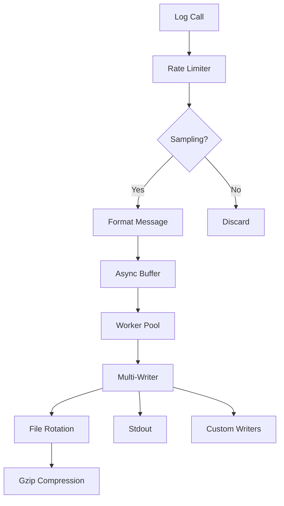

# GourdianLogger – High-Performance Structured Logging for Go


[](LICENSE)
[](coverage.html)

**gourdianlogger** is a production-grade logging library designed for modern Go applications that demand both performance and flexibility. Built with zero-allocation paths for critical operations and lock-free designs where possible, it delivers:

- 📊 **Dual-Format Output**: Structured JSON and human-readable plain text
- ⚡ **Asynchronous Pipeline**: 220k+ logs/sec with configurable backpressure
- 🔄 **Intelligent Rotation**: Size + time-based with gzip compression
- 🎚️ **Runtime Controls**: Dynamic log levels and sampling
- 🔍 **Precision Tracing**: Granular caller information (file:line:function)
- 🛡️ **Production Safety**: Rate limiting and graceful degradation

## 🌟 Why GourdianLogger?

| Feature               | Standard log | GourdianLogger |
|-----------------------|--------------|----------------|
| Structured Logging    | ❌ No        | ✅ Yes         |
| Async Performance     | ❌ No        | ✅ 220k+/sec   |
| Log Rotation          | ❌ Manual    | ✅ Automatic   |
| Dynamic Level Control | ❌ No        | ✅ Runtime     |
| Caller Tracing        | ❌ Basic     | ✅ Configurable|
| Multi-Output          | ❌ No        | ✅ Unlimited   |

## 📦 Installation

```bash
go get github.com/gourdian25/gourdianlogger@latest
```

**Minimum Requirements**: Go 1.18+ (for generics optimizations)

## 🚀 Quick Start

### Basic Initialization

```go
package main

import (
 "github.com/gourdian25/gourdianlogger"
)

func main() {
 // Default config (DEBUG level, plain text, ./logs/app.log)
 logger, err := gourdianlogger.NewGourdianLoggerWithDefault()
 if err != nil {
  panic("Logger init failed: " + err.Error())
 }
 defer logger.Close() // Ensures buffer flush

 logger.Info("Service initializing")
 logger.Debugf("Config loaded: %+v", config)
}
```

### Production Configuration

```go
config := gourdianlogger.LoggerConfig{
 Filename:        "api-server",
 LogsDir:         "logs",
 MaxBytes:        100 * 1024 * 1024, // 100MB
 BackupCount:     14, // 2 weeks retention
 LogLevel:        gourdianlogger.INFO,
 Format:          gourdianlogger.FormatJSON,
 BufferSize:      5000,  // 5k log buffer
 AsyncWorkers:    8,     // 8 writer goroutines
 CompressBackups: true,  // Gzip rotated logs
 RotationTime:    24 * time.Hour, // Daily rotation
 EnableCaller:    true,  // Include caller info
 CallerDepth:     4,     // Skip 4 stack frames
}

logger, err := gourdianlogger.NewGourdianLogger(config)
```

## 🏗 Core Architecture



## ⚙️ Configuration Deep Dive

### Log Rotation Strategies

**1. Size-Based Rotation**

```go
config.MaxBytes = 50 * 1024 * 1024 // 50MB per file
config.BackupCount = 10 // Keep 10 generations
```

**2. Time-Based Rotation**

```go
config.RotationTime = 7 * 24 * time.Hour // Weekly
```

**3. Hybrid Approach**

```go
config.MaxBytes = 1 * 1024 * 1024 // 1MB
config.RotationTime = time.Hour   // Hourly
```

### Performance Tuning

| Parameter       | Recommendation              | Impact                     |
|-----------------|-----------------------------|----------------------------|
| `BufferSize`    | 1000-10000                  | Higher = more memory, less drops |
| `AsyncWorkers`  | 2-4 x CPU cores             | Balance throughput vs contention |
| `MaxLogRate`    | 100-10000 (per service)     | Prevents log storms        |
| `SampleRate`    | 10-100 for DEBUG logs       | Reduces volume             |

### Structured Logging Example

```go
logger.WithFields(map[string]interface{}{
 "request_id":  ctx.Value("requestID"),
 "user_agent":  r.UserAgent(),
 "latency_ms":  latency.Milliseconds(),
 "status_code": status,
}).Info("HTTP request completed")
```

**Output (JSON):**

```json
{
  "timestamp": "2025-04-19T14:32:45.123456Z",
  "level": "INFO",
  "message": "HTTP request completed",
  "request_id": "a1b2c3d4",
  "user_agent": "Mozilla/5.0",
  "latency_ms": 142,
  "status_code": 200,
  "caller": "server/handler.go:127"
}
```

## ⚡ Performance Optimization

### Zero-Allocation Paths

Key optimizations:

- Reused buffer pools
- Pre-allocated level strings
- Stack-based formatting for primitives

### Benchmark Results

```bash
go test -bench=. -benchmem
```

| Operation                | Ops/sec    | ns/op  | Memory  | Allocs |
|--------------------------|------------|--------|---------|--------|
| PlainText-NoFields       | 285,492    | 3502   | 0 B     | 0      |
| JSON-WithFields          | 189,304    | 5281   | 832 B   | 2      |
| AsyncThroughput          | 224,192    | -      | -       | -      |
| RotationUnderLoad        | 18 rotates/sec | -    | -       | -      |

## 🛠 Advanced Features

### Dynamic Log Levels

```go
// Change level based on external signal
logger.SetDynamicLevelFunc(func() gourdianlogger.LogLevel {
 if os.Getenv("DEBUG_MODE") == "1" {
  return gourdianlogger.DEBUG
 }
 return gourdianlogger.WARN
})
```

### Custom Error Handling

```go
logger.ErrorHandler = func(err error) {
 sentry.CaptureException(err)
 metrics.Increment("log_errors")
 
 // Fallback to syslog if file writing fails
 if isDiskError(err) {
  syslog.Write([]byte(err.Error()))
 }
}
```

### Network Output

```go
conn, _ := net.Dial("tcp", "logstash:5000")
logger.AddOutput(conn)

// With reconnect logic
logger.AddOutput(&ReconnectingWriter{
 Endpoint: "logstash:5000",
 Timeout:  5 * time.Second,
})
```

## 🔍 Debugging Tips

### Common Issues

1. **Missing Logs**
   - Check `SetLogLevel()` threshold
   - Verify buffer isn't full (async mode)
   - Confirm no rate limiting (`MaxLogRate`)

2. **Permission Errors**

   ```bash
   sudo mkdir /var/log/myapp
   sudo chown $USER /var/log/myapp
   ```

3. **Performance Bottlenecks**

   ```go
   // Compare sync vs async:
   config.BufferSize = 0 // Synchronous mode
   ```

## 🧪 Testing Integration

### Unit Test Setup

```go
func TestHandler(t *testing.T) {
 // Capture logs in buffer
 var buf bytes.Buffer
 
 config := gourdianlogger.DefaultConfig()
 config.Outputs = []io.Writer{&buf}
 config.BufferSize = 0 // Synchronous for tests
 
 logger, _ := gourdianlogger.NewGourdianLogger(config)
 
 // Test your component
 handler := NewHandler(logger)
 handler.Process()
 
 assert.Contains(t, buf.String(), "expected log message")
}
```

## 📚 API Reference

### Core Methods

| Method | Description | Example |
|--------|-------------|---------|
| `SetLogLevel()` | Change minimum level | `logger.SetLogLevel(gourdianlogger.WARN)` |
| `AddOutput()` | Add writer | `logger.AddOutput(os.Stderr)` |
| `WithFields()` | Structured log | `logger.WithFields(fields).Info()` |
| `Rotate()` | Manual rotation | `logger.Rotate()` |

### Log Levels

```go
const (
 DEBUG LogLevel = iota // Development diagnostics
 INFO                  // Operational messages
 WARN                  // Notable events
 ERROR                 // Failures
 FATAL                 // Critical failures (exits)
)
```

## 🚨 Production Checklist

1. **Directory Permissions**

   ```bash
   mkdir -p /var/log/myapp
   chmod 750 /var/log/myapp
   ```

2. **Log Rotation Monitoring**

   ```go
   // Alert if rotation fails
   logger.ErrorHandler = func(err error) {
    if strings.Contains(err.Error(), "rotation") {
     alert.Send("Log rotation failed")
    }
   }
   ```

3. **Resource Limits**

   ```go
   // Prevent memory exhaustion
   config.BufferSize = 10000 // Max 10k buffered logs
   ```

## 🤝 Contributing

1. **Development Setup**

   ```bash
   git clone https://github.com/gourdian25/gourdianlogger
   cd gourdianlogger
   make dev
   ```

2. **Run Verification**

   ```bash
   make test      # Unit tests
   make bench     # Benchmarks
   make coverage  # Coverage report
   ```

3. **Submission Guidelines**
   - Include benchmark comparisons for performance changes
   - Add tests for new features
   - Update documentation

## 📑 License

gourdianlogger is licensed under the **MIT License**.  
You are free to use, modify, distribute, and adapt the code for both personal and commercial use.

See the full license [here](./LICENSE).

---

## 👨‍💼 Maintainers

Maintained and actively developed by:

- [@gourdian25](https://github.com/gourdian25) — Creator & Core Maintainer
- [@lordofthemind](https://github.com/lordofthemind) — Performance & Benchmarking

Want to join the team? Start contributing and open a discussion!

---

## 🔒 Security Policy

We take security seriously.

- If you discover a vulnerability, please **open a private GitHub issue** or contact the maintainers directly.
- Do **not** disclose vulnerabilities in public pull requests or issues.

For all disclosures, follow responsible vulnerability reporting best practices.

---

## 📚 Documentation

Full API documentation is available on [GoDoc](https://pkg.go.dev/github.com/gourdian25/gourdianlogger).  
Includes:

- Public types and interfaces
- Usage patterns
- Token claim structures

---

Made with ❤️ by Go developers — for Go developers.  
Logging shouldn't be hard. gourdianlogger makes it elegant, efficient, and production-ready.
